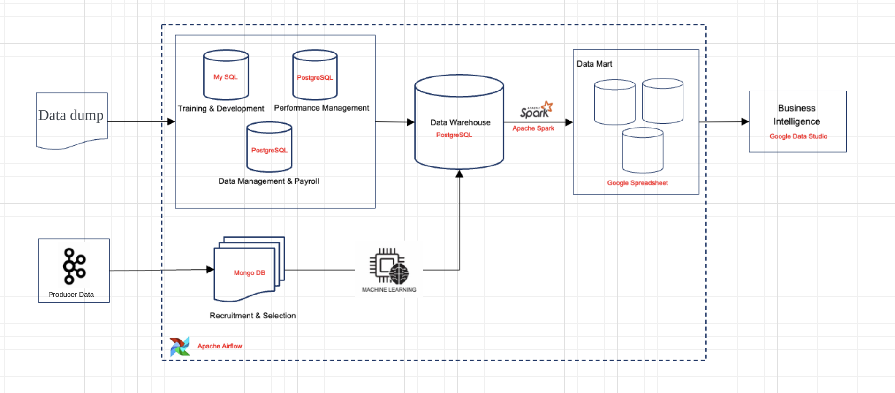
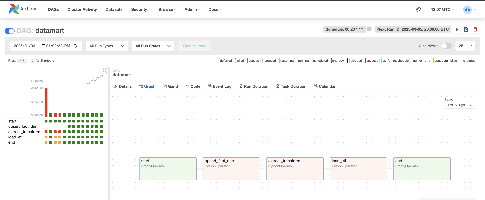

# Data Orchestration Framework: Human Capital Analytics

This repository demonstrates an end-to-end **Data Engineering and Orchestration Framework** designed to analyze Human Capital data, leveraging various data sources and tools to deliver actionable insights through dashboards.

---

## 🌟 Project Overview

Managing Human Capital data is a challenge due to the diversity of systems (e.g., recruitment, payroll, training, performance). This project builds a **Data Orchestration Framework** to streamline the collection, processing, storage, and visualization of Human Capital data. The solution integrates various sources into a centralized data warehouse and data marts to provide actionable insights via dashboards.

## Objectives

1. Automate the ETL process for multiple Human Capital data sources.
2. Integrate batch and real-time data using modern orchestration tools.
3. Deliver insightful dashboards for HR analytics.
4. Predict key metrics like recruitment success and employee performance.

## Deliverables

1. **ETL Pipelines**: Seamless integration of data sources using Apache Kafka, Apache Spark, and Airflow.
2. **Data Warehouse**: Consolidated storage for long-term historical data.
3. **Data Mart**: Aggregated data prepared for analytics and reporting.
4. **Dashboards**: Recruitment, payroll, and performance insights with **Google Data Studio**.
5. **Machine Learning Models**: Predictive insights for better workforce management.

## Expected Benefits

1. Centralized data access for better Human Capital Management.
2. Time savings through automated data pipelines.
3. Actionable insights with real-time and batch data dashboards.
4. Improved recruitment and performance strategies with ML predictions.

---

## Project Architecture Overview



### Components

1. **Data Sources**: https://drive.google.com/drive/folders/18gxyJoK63endBUyjFr4e-V13llqLgFfj?usp=sharing
    - **Recruitment**: MongoDB
    - **Payroll**: PostgreSQL
    - **Training**: MySQL
    - **Performance**: PostgreSQL
2. **Ingestion**:
    - Kafka handles real-time and batch data ingestion.
3. **Processing**:
    - Apache Spark for cleaning, transformation, and merging.
4. **Storage**:
    - Data Warehouse for historical data.
    - Data Mart for analytical queries.
5. **Visualization**:
    - Google Data Studio dashboards for insights.

---


## Project Structure

```python
data-orchestration-framework
├── dags/
│   ├── datawarehouse/    
│	    ├── model/ 
│	    ├── query 
│	    ├── config.json 
│	    ├── connection.py    
│	    ├── main.py    
│	    ├── requirements.txt    
│   ├── modules/    
│	    ├── etl.py    
│   ├── datamart.py    
├── data_dump/
│	    ├── csv_file 
│	    ├── data_dump.ipynb 
│	    ├── producer.ipynb 
├── images/         
├── .gitignore
├── Dockerfile     
├── README.md                 
├── consumer.ipynb                         
├── docker-compose.yaml                 
├── requirements.txt            
└── .env                  
```

## Key Steps and Features

1. **Data Dump**
    - Loaded three datasets (*Management & Payroll*, *Performance Management*) into a PostgreSQL database (OLTP) and one dataset (*Training & Development*) into MySQL.
    - View code: [`data_dump/data_dump.ipynb`](https://github.com/jeanneta/data-orchestration-framework/blob/main/data_dump/data_dump.ipynb)
2. **Kafka Producer**
    - Created a Kafka producer to send the *Recruitment & Selection* dataset in CSV format.
    - View code: [`data_dump/producer.ipynb`](https://github.com/jeanneta/data-orchestration-framework/blob/main/data_dump/producer.ipynb)
3. **Kafka Consumer**
    - Built a Kafka consumer to receive data from the producer and store it in MongoDB.
    - View code: [`consumer.ipynb`](https://github.com/jeanneta/data-orchestration-framework/blob/main/consumer.ipynb)
4. **Data Warehouse (OLAP) ERD**
    - Designed the ERD for a data warehouse combining all four OLTP datasets.
    - View schema: [`dags/datawarehouse/query`](https://github.com/jeanneta/data-orchestration-framework/tree/main/dags/datawarehouse/query)
5. **ETL Pipeline (OLTP to OLAP)**
    - Developed an ETL pipeline to load data from OLTP to the data warehouse (OLAP structure) using Airflow.
    - Data Warehouse consolidates cleaned data into dimension and fact tables.
    - View code: [`dags/datawarehouse/main.py`](https://github.com/jeanneta/data-orchestration-framework/blob/main/dags/datawarehouse/main.py)
6. **Machine Learning Integration**
    - Performed machine learning analysis on unstructured OLTP data and built prediction models.
    - View code: [`dags/datawarehouse/model`](https://github.com/jeanneta/data-orchestration-framework/tree/main/dags/datawarehouse/model)
7. **Data Mart ERD**
    - Designed the ERD for a data mart based on specific business use cases.
    - Included Airflow scheduling to transform data from the data warehouse to the data mart.
    - View code: [`dags/modules/etl.py`](https://github.com/jeanneta/data-orchestration-framework/blob/main/dags/modules/etl.py)
8. **ETL Pipeline (OLAP to Data Mart)**
    - Built an ETL pipeline to transfer data from the data warehouse to the data mart (e.g., SharePoint) and implemented Airflow scheduling.
    - Spark cleans and transforms raw data for loading into Data Mart.
    - View code: [`dags/datamart.py`](https://github.com/jeanneta/data-orchestration-framework/blob/main/dags/datamart.py)
9. **Google Sheets Integration**
    - Uploaded transformed data from the data mart to Google Sheets for analysis.
10. **Dashboard**
    - Created an interactive dashboard to analyze and visualize business insights using Looker Studio in near real-time.

## Additional Benefits

1. Scalability with distributed systems like Spark and Kafka.
2. Modularity for extending the pipeline with additional data sources.
3. Prediction of recruitment success and employee performance with ML models.

## 🛠️ Tech Stack Used

- **Airflow**: Workflow orchestration.
- **Apache Kafka**: Real-time data streaming.
- **Apache Spark**: Data processing and transformation.
- **PostgreSQL**: Data Warehouse.
- **MongoDB**: Recruitment data source.
- **MySQL**: Training data source.
- **Google Data Studio**: Dashboarding.

## 📜 Pipeline Overview

1. **Airflow DAGs** orchestrate the ETL workflow.
2. **Kafka** ingests real-time and batch data.
3. **Spark** processes raw data into structured formats.
4. **PostgreSQL** stores the consolidated data warehouse.
5. **Dashboards** provide analytics for key HR metrics.

---

## ⚙️ Key Components

### Airflow DAG Execution

- **Upsert Fact/Dim**:
    
    Ingests data from multiple data sources into the Data Warehouse (DWH), transforming it into a structured format.
    
- **Extract Transform**:
    
    Processes data within the DWH, applies further transformations using Spark, and prepares it for analysis.
    
- **Load ETL**:
    
    Loads the transformed data into the Data Mart, then uploads the data to Google Sheets for dashboard visualization.
    
    


### **Kafka** Producer

- **Dataset Source**: The producer reads datasets related to [e.g., recruitment & selection] and sends the data in real-time streams to Kafka topics.
- **Implementation**: The producer is configured to batch and send data to ensure smooth ingestion.

### Kafka Consumer

- **MongoDB Storage**: The consumer listens to the Kafka topic, ingests the streamed data, and writes it into a MongoDB database for further processing.
- **Structure**: Data ingested into MongoDB is stored in a semi-structured format, making it easier to perform OLTP operations.

### **Apache Spark**

- Cleans, processes, and transforms data before loading into the Data Mart.

### **Google Data Studio**

Spreadsheet: [https://docs.google.com/spreadsheets/d/1IMna3cyPhXhW66rf10bZIrgA7UIVohP-hywABMQttJA/edit?usp=sharing](https://docs.google.com/spreadsheets/d/1IMna3cyPhXhW66rf10bZIrgA7UIVohP-hywABMQttJA/edit?usp=sharing)

Dashboard: 

Dashboards for:

1. Recruitment analysis.
2. Payroll insights.
3. Employee performance tracking.
4. Employee demographics.

---

## 🔮 Future Enhancements

1. **Real-Time Dashboards**:
    - Stream data directly to dashboards using Kafka and Spark Streaming.
2. **Additional Data Sources**:
    - Integrate APIs (e.g., LinkedIn, Spotify) for external insights.
3. **Advanced ML Models**:
    - Predict employee churn and optimize recruitment strategies.

---

## 🏁 Conclusion

This project showcases a robust **Data Orchestration Framework** to address challenges in managing Human Capital data. By integrating modern technologies like Kafka, Spark, and Airflow, it provides a scalable, reliable, and efficient solution for HR analytics.